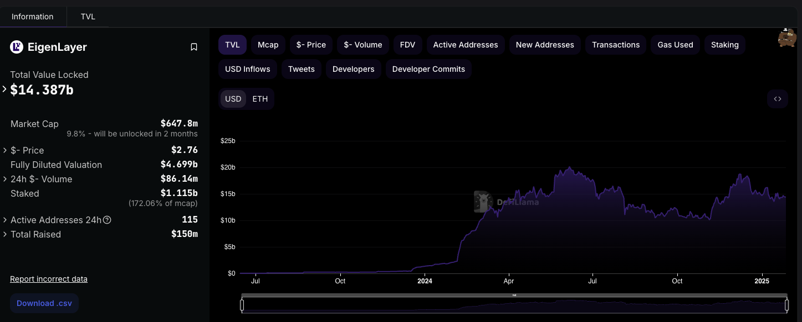
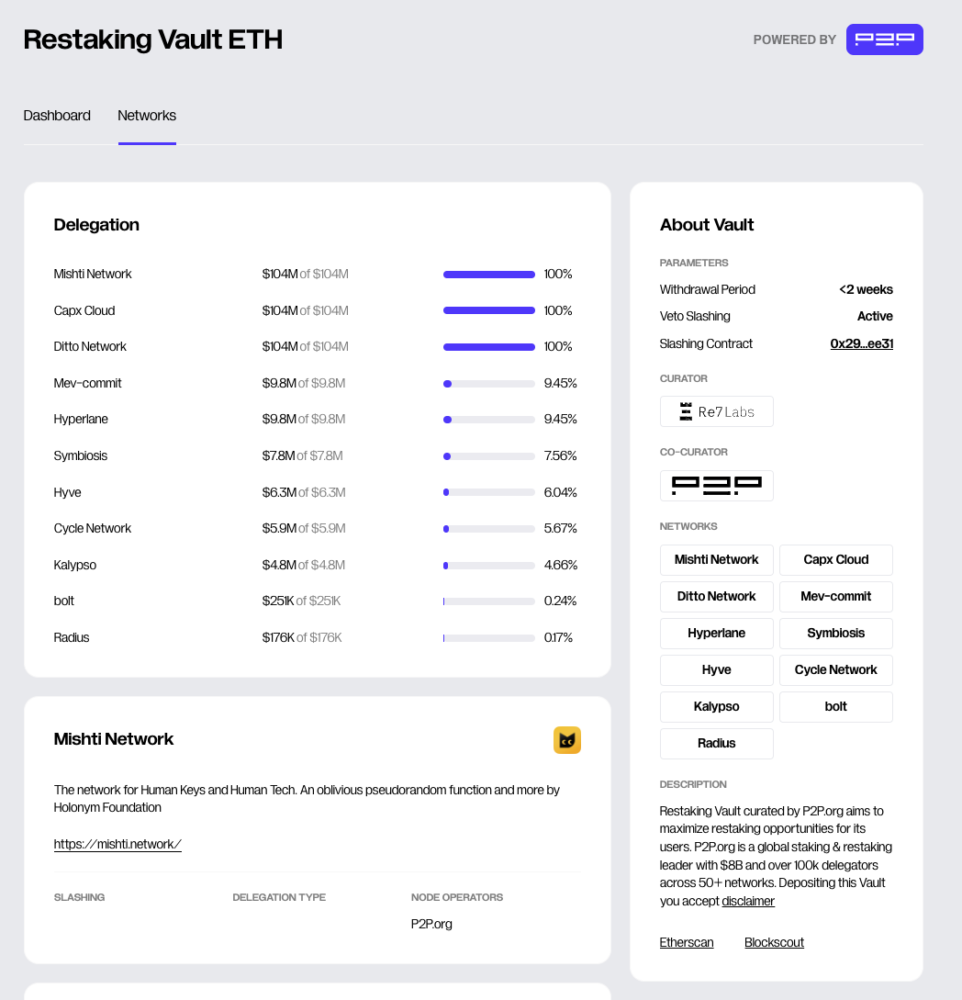

+++
title = "Crash course on the state of restaking: 2025"
date = 2025-01-25T00:00:00Z
authors = ["9oelm"]
sort_by = "date"

[extra]
katex_enable = true
+++

## Recap on the problems in existing PoS networks

1. **Bootstrapping and attracting capital into a PoS network is difficult**, especially for smaller chains. 

> For example, in the Cosmos ecosystem, consisting of over 60 application specific chains, initial annualized inflation rates of 20% to 100% are quite common. Such high inflation hampers the long term growth of the chain. [^1]

1. **Volatility**. The cost of corruption for an attacker fluctuates based on the staked token's underlying price.

1. **Centralization.** The assets of many PoS chains are concentrated in the hands of early investors, founders and team members and foundations, at least in the early stage of the projects. A concentrated asset exposes the network to centralization when the asset is staked to validate the network. [^2] For example, approximately 91% of Toncoin tokens are concentrated in a few wallets, leading to concerns over centralization. While such high concentrations often suggest strong backing from major investors or early adopters, they also carry risks such as potential market manipulation or volatility. If large amounts of TON tokens are moved or sold by these holders, it could lead to significant price swings that may harm market stability. [^3]

These reasons are good enough for the rise of restaking, because it aims to eliminate the need for bootstrapping a project token and resolving the intricacies of maintaining its price.

## Why do people restake anyways?

### Low utility of LSTs

As we explored before at [Making sense of liquid staking](https://lazer1.xyz/blog/making-sense-of-liquid-restaking/), LSTs are tokens that represent the user's staking position, free to be transferred over for any purposes.

Still now in the DeFi landscape, there is not so much utility with LSTs. Historically speaking, the deposit interest rate is surprisingly low compared to other unstaked versions of tokens. Let's take an [example of wstETH on Aave over the past 365 days](https://aavescan.com/ethereum-v3/0x7f39c581f595b53c5cb19bd0b3f8da6c935e2ca00x2f39d218133afab8f2b819b1066c7e434ad94e9e).

The formula of any autonomous yield-bearing system is simple: there needs to be a demand for the token to generate a yield. In the case of wstETH on Aave v3, there need to be people who are willing to borrow wstETH. However, there aren't just enough people who want to do it. Just let that sink that in for a second - why would you ever want to borrow wstETH instead of WETH anyways? Where are you going to use it?

In contrast, take a look at [the historical borrow rate of USDC in the same Aave market](https://aavescan.com/ethereum-v3/0xa0b86991c6218b36c1d19d4a2e9eb0ce3606eb480x2f39d218133afab8f2b819b1066c7e434ad94e9e). We can easily notice that USDC, being a stablecoin, has a lot more utility than wstETH.

This is a general pattern over any other staked asset across the network:

You can see that they are in a very low range of deposit and borrrow interest rates, typically ranging from 0% to 1%. This means there's not a big demand for these assets.

In comparison, observe that normally, other mainstream, unstaked assets would give tasty yields:

And yes, you could potentially provide liquidity to Uniswap and earn fees, but that requires holding both tokens that form the pool. In fact, it seems that not a lot of people are interested in providing liquidity to wstETH pools or even swapping wstETH with something else in the first place. As of today, there are only two wstETH pools on Uniswap amongst the top 100 pools by TVL: [wstETH/ETH at 17M TVL and 6.181% APR](https://app.uniswap.org/explore/pools/ethereum/0x109830a1AAaD605BbF02a9dFA7B0B92EC2FB7dAa) and [another wstETH/ETH pool at 2M TVL and 0.867% APR](https://app.uniswap.org/explore/pools/arbitrum/0x35218a1cbaC5Bbc3E57fd9Bd38219D37571b3537).

Balancer has a few wstETH pools too: 
- [wstETH/ETH](https://balancer.fi/pools/ethereum/v2/0x93d199263632a4ef4bb438f1feb99e57b4b5f0bd0000000000000000000005c2): 0.4% base APR from swap fees, at 37M TVL.
- [wstETH/AAVE](https://balancer.fi/pools/ethereum/v2/0x3de27efa2f1aa663ae5d458857e731c129069f29000200000000000000000588): 1.19% base APR from swap fees, at 312M TVL.
- And many other exotic pairs.

But the point is that generating yield from swaps intrinsically exposes you to greater risks, first because you need to hold another token. For example, if you are an liquidity provider for wstETH/ETH, you are essentially exposing yourself to x2 ETH than when you would just hold wstETH. So in case of a price drop, you are losing double more money. This is worse for wstETH with an exotic pair, increasing the likelihood of [impermanent loss](https://support.uniswap.org/hc/en-us/articles/20904453751693-What-is-Impermanent-Loss). Also, there's much less reason to expect high APRs from a pool that swaps wstETH with an exotic pair, because it must not be too popular. This suggests that a rational investor who still wants to hold onto wstETH and create a pool to minimize risks, would most likely create a staking pool (namely, staked asset/unstaked asset, like wstETH/ETH).

Moreover, the TVL of these staking pools across swaps is not big compared to other popular pairs that easily go over 100-200M TVL. This means that generally liquidity providers are less inclined to allocate significant capital to these pools compared to more popular or volatile pairs. Given this TVL, these liquidity providers represent only a very small proportion of the entire group of staked token holders who otherwise are not willing to use LPs to earn yield for their own reasons. If someone with a huge capital were to bring in liquidty into wstETH/ETH pairs, that is going to be another problem as well, because that will significantly drop the APR of the pool. All in all, we've discovered that:

1. People are not really interested in swapping wstETH with something else, compared to other mainstream pools.
2. People are not really interested in providing wstETH to a liquidity pool, to other mainstream pools.

Therefore, while liquidity pools could certainly be used as an option for yield, it does not appear to be a very attractive option for those who hold staked tokens.

### Positive feedback loop in an expectation for rewards and airdrops

Since LSTs won't hardly give satisfactory, risk-safe yields, people ran to EigenLayer and started depositing their idle staked ETH.

It only took a year for them to reach 1B in TVL! And now it's sitting at 14.3B. This definitely tells something about the idleness of staked tokens.

[EigenLayer only launched their mainnet on Apr 9, 2024](https://www.blog.eigenlayer.xyz/mainnet-launch-eigenlayer-eigenda/). This is almost a year away from [June 2023 when they first launched their stage 1, where hardly any core features of a restaking protocol were built](https://www.blog.eigenlayer.xyz/eigenlayer-stage-1-mainnet-launch/). It was just a bare-metal deposit and withdrawal system without yields. But still, people ran and deposited, mainly in expectation for airdrop points. Increasing number of depositors led to even higher TVL, which in turn resulted in even higher expectation for project token price, which in turn brought in even more depositors who shared the same expectation.

Other protocols saw a similar trend. To name a few, Symbiotic, Karak, Babylon, Solayer and alike. They all saw a great increase in TVL, which is incomparable to other DeFi protocols, which are usually in the unit of few tens or hundreds of millions only. Today, these are some of the top DeFi protocols by TVL in the world.

# Restaking landscape

In this section, we review how different restaking protocols have been evolving across different chains. The biggest premise of a restaking protocol is that it needs to support a major asset that has a market cap that is large enough to share an economic security. For this reason, the restaking protocols have been mainly developed on Bitcoin, Ethereum, and Solana.

## Ethereum

### EigenLayer

Since its birth in 2023, EigenLayer's goal has been to sharing the security of an existing network, namely Ethereum mainnet. It provides decentralized systems with no additional cost of having to launch a project token. EigenLayer is the first restaking protocol ever to be created. Now in 2025, EigenLayer supports depositing more ERC20 tokens. However, Ethereum remains as the most dominant asset that is deposited:

_Restaked token distribution on Defillama as of Jan 31, 2025_

_Restaked token distribution on EigenLayer App as of Jan 31, 2025_

Approximately, more than 95% of the restaked tokens account for staked ETH variants and $EIGEN token. This is an interesting point, because Eigenlayer clearly supports more ERC20 tokens, like below:

This may suggest that a restaking protocol's positioning strategy is important, as it is a signal that most users still tend to bring in Ethereum instead of other ERC20s.

#### How EigenLayer works

These are the few most important concepts in EigenLayer's architecture, which are also shared by other prominent protocols. Let's go into detail:

**Restakers**. people who stake again their staked token to EigenLayer. This term has been diluted a little bit, as people also 'restake' plain, unstaked ERC20 tokens as well as ETH too. But we will keep calling it restaking and restakers to refer to the activity of delegating tokens of value to provide security for decentralized services.

**Actively Validated Services (AVSs henceforth)**. decentralized service that has unique off-chain logics that are validated by on-chain contracts. The categories of AVS are seen below:

A practical example of an AVS is [EigenDA](https://docs.eigenda.xyz/). It is an AVS developed by EigenLayer, which specifically takes care of data availability problems for modern rollups on Ethereum. Another example is [Hyperlane](https://app.eigenlayer.xyz/avs/0xe8e59c6c8b56f2c178f63bcfc4ce5e5e2359c8fc), which is an interoperability protocol.

Every AVS is an on-chain contract for validation and an off-chain network of operators. [TODO]

**Slashing**. Before EigenLayer, it used to mean penalizing dishonest or dysfunctional validators in a PoS network like Ethereum. Now, in EigenLayer, slashing refers to penalizing operators who secured an AVS that could not complete a task correctly by burning the restaked tokens.

**Operators**. They run AVS and send the evidence of the execution on-chain to confirm the work. Restakers choose to delegate their tokens to specific operators. There are many operators on EigenLayer today. The primary reason for being an operator is an economic incentives in expectation for rewards for their operating jobs. By default, Operators will earn a flat 10% split on rewards. The rest of the reward is claimable by the operator's delegated stakers.

It's worth noting that the operators cannot directly transfer the delegated tokens, but they relate them to AVSs for slashing, so that when real slashing happens, the delegated tokens will be burnt. [TODO]

_Restakers choose to delegate their tokens to specific operators._

_A list of operators on EigenLayer._

**Free-market governance**. As we will cover more later on, different operators will servce different risk appetites. In a sense, operators act like different vaults that are exposed to different levels of risks. For example, Operator A may serve AVSs that are prone to more slashing, resulting in higher rewards APR but higher chance of slashing (loss). In contrast, Operator B may serve AVSs that are more stable and less risky. These AVSs will tend to be less sophisticated and to run simpler tasks, resulting in smaller rewards APR and lower chance of slashing. 

Practically speaking, let's say Operator A delegates its restaked tokens to a bridge. Operator B delegates its restaked tokens to a decentralized system that calculates the sum of a two different numbers. It becomes pretty obvious that the chances of slashing is higher on the former case, and lower on the latter. The same goes for the rewards; Operator A would yield more rewards for its restakers, and B much less for its restakers.

For this reason, there remains a problem of finding an appropriate level of risk exposure to different AVS categories, because there are many operators, and EigenLayer does not offer a specific interface for comparing risks across different operators and AVSs. If you are interested in this problem, you might want to look into what [YieldNest](https://docs.yieldnest.finance/introduction/why-yieldnest) is doing: optimizing yield for the users by providing offers users controlled, liquid, and risk-adjusted exposure to curated AVS categories.

#### No native fungible token on EigenLayer

Additionally, EigenLayer does not mint a token representing the restaking position upon restaking (e.g., rstETH). This should be pretty clear if you have been following. The reason is that the risk exposure across different operators is different, so there can never be the 'same' restaked ETH.

However, it is possible to get a liquid restaking token on other liquid staking platforms like Ether.fi, where Ether.fi itself will be an operator on EigenLayer, managing a set of AVSs. On [Ether.fi, the restaking position delegated to its operator is represented as eETH](https://etherfi.gitbook.io/etherfi/getting-started/faq). This is possible because there is only one type of risk exposure based on what AVSs Ether.fi operates. Holding this token will earn you staking AND restaking APR, as well as points across different DApps like EigenLayer.

#### Eigen token

[TODO]

### Symbiotic

Symbiotic has the same goal as EigenLayer: a marketplace for a pooled economic security. Networks will come to Symbiotic to borrow security, and restakers will supply that.

_Symbiotic's core participants._

There are a few differences from EigenLayer:

**Collateral**. From its inception, Symbiotic has supported a wide range of ERC20 tokens. This led to more diverse ERC20 tokens other than ETH derivatives being restaked on Symbiotic than EigenLayer, although ETH derivatives account for the most TVL. For example, it has an [lvlwaUSDC vault](https://app.symbiotic.box/vault/0x67F91a36c5287709E68E3420cd17dd5B13c60D6d), USDC derivative on [level.money](https://level.money).

**Networks**. This is what analogous what an AVS is on EigenLayer. It is any "systems that need economic security to operate safely. These can be Layer 1 blockchains, Layer 2 solutions, or other decentralized systems that require **stake-based security guarantees**."

**Vaults.** There is no such thing as vaults on EigenLayer. Instead, EigenLayer leaves that responsibility to the external developers. If one wanted, someone could create something like [YieldNest](https://docs.yieldnest.finance/introduction/why-yieldnest), but this would be outside of the core EigenLayer protocol.

However, on Symbiotic, vaults are natively built into the protocol. Vaults are just like the traditional vaults in DeFi; different vaults have their own strategies to delegate the stake to operators and thus networks.

_[An example vault on Symbiotic that restakes wstETH, curated ER7 capital](https://app.symbiotic.fi/vault/0x7b276aAD6D2ebfD7e270C5a2697ac79182D9550E)._

_[Detailed information about the same vault, but more information on Mellow Finance](https://app.mellow.finance/partners/p2p/vaults/ethereum-rsteth)._

**Operators.** They are similar to what they are on EigenLayer. They are entities that operate validators, nodes, or any software for the network infrastructure. They are backed by restaked tokens in the vaults, and work on the operation of the networks.

### Karak

_[Karak](https://karak.network/) is heavily underdocumented. Skipping for now._

## Solana

### Solayer

**Approach.** Solana is takes an interesting approach that is different than its counterparts on Ethereum. Its major focus is "the hardware accelerated SVM blockchain" as it is on their homepage.

Their direction is fundamentally different from EigenLayer and alike in the sense that they do aim to generate revenue as a protocol themselves by leveraging state-of-the-art tech. The revenue does not come from the restaking part; it comes from their own superior tech that enables:

1. Increase probability of securing block space
2. Prioritized transaction inclusion

Solayer team decided to tackle two of these problems. And note that this was only possible because Solana, being a very popular blockchain, is a battlefield for the users to compete for block space and transaction priority. So the problems that they are solving becomes increasingly valuable in the context of Solana.

For this reason, Solayer’s initial emphasis is on enhancing the capabilities of native Solana dApps, which they call "Endogenous AVS", meaning, AVS on Solana only. This is in contrast to EigenLayer or Symbiotic which serve what's called "Exogenous AVS", meaning any decentralized services that require stake-based validation mechanisms not necessarily related to a specific blockchain, such as oracles or bridges.

**Why was this approach possible?** This is because Solayer's team was so technically talented that they could write a hardware-accelerated, superfast SVM L1 blockchain from scratch. Personally speaking, I feel like this is the best approach amongst all restaking protocols, because there are still concerns as to if AVSs on EigenLayer or Symbiotic will generate enough revenue to return a satisfible return to all restakers. For the AVSs to be used, there needs to be enough demand. But that's up to the AVSs themselves to figure out. Then after all, restakers might not be able to get a sustainable yield on EigenLayer.

Recognizing this problem, Solayer decided to leverage their tech talents to develop a protocol-native yield solution, which was to build a technically superior SVM that can be paid to be used by AVSs.

**Architecture**. The general architecture remains the same as EigenLayer and other prominent restaking protocols.

### Picasso

_[Picasso](https://www.picasso.network/) is skipped for now._

### Jito

**Node Consensus Networks**. This is what an AVS is on EigenLayer.

**VRT**. Liquid restaking token in Jito restaking vaults.

## Bitcoin

How the blockchain of Bitcoin is not run on PoS, but still can be restaked.

### Babylon

**Big idea.** It is a Bitcoin staking started with this problem:

> Bitcoin is a Proof-of-Work chain but it is also a $600 Billion asset and most of it is idle capital.

And the idea is very simple:

>  We propose the concept of Bitcoin staking which allows bitcoin holders to stake their idle bitcoins to increase the security of PoS chains and in the process earn yield.

**Rationale.** Bitcoin, being a PoW chain, has the following differences from PoS assets:

1. Unused. The token of Bitcoin is not being used to secure the chain.
2. Idle. Most Bitcoins need to be bridged over to other chains to generate yields. But there are risks and hassles to it. So most Bitcoins sit idle.
3. More decentralized. A common problem in PoS networks is that it is hard to evenly distribute the token amongst the network participants and users. Usually, the early movers will have the most tokens and thus the most stake. Concentration exposes the network to centralization risks. Bitcoin is fair and decentralized, although arguably inefficient.
4. Less volatile. Volatility poses a risk to PoS networks in case of a significant price drop because the cost of corruption for an attacker would drop too.

**PoS Market.** Babylon proposes a simple marketplace where BTC holders stake their BTC to PoS chains in need of economic security:

This is similar to EigenLayer where AVSs in need to economic security would bargin their rewards in exchange for restaked assets.

**Architecture**.

There are many things in the diagram, but it will suffice to understand that Babylon blockchain will be running to facilitate BTC staking, and its node will communicate through IBC Relayer for other chains to consume the restaked tokens.

It's important to note that in fact the restaked tokens do not get bridged over to the actual chains. When slashing happens, the restaked tokens on Bitcoin will be directly slashed.

### Pell network

WIP

# Current problems

## Demand for restaked tokens, revenue model, and product-market fit

Revenues come from AVS and chains. But AVS should make enough money and pay it to feed all restakers.

# References

[^1]: https://docs.babylonlabs.io/papers/btc_staking_litepaper.pdf
[^2]: https://docs.babylonlabs.io/papers/btc_staking_litepaper.pdf
[^3]: https://thecurrencyanalytics.com/altcoins/toncoin-price-rally-and-centralization-concerns-156100

- [[Four Pillars] Restaking Stack: Categorizing the Restaking Ecosystem](https://4pillars.io/en/articles/restaking-stack-restaking-series-1)
- [[Gauntlet] Inside the Restaking Ecosystem: Restaking Protocols](https://www.gauntlet.xyz/resources/inside-the-restaking-ecosystem-restaking-protocols)
- [[EigenLayer] Overview](https://docs.eigenlayer.xyz/eigenlayer/overview)
- [[EigenLayer] Whitepaper](https://docs.eigenlayer.xyz/assets/files/EigenLayer_WhitePaper-88c47923ca0319870c611decd6e562ad.pdf)
- [[EigenLayer] Eigen token Whitepaper](https://docs.eigenlayer.xyz/assets/files/EIGEN_Token_Whitepaper-0df8e17b7efa052fd2a22e1ade9c6f69.pdf)
- [[Symbiotic] Symbiotic docs](https://docs.symbiotic.fi/)
- [[BlockSec] Can Symbiotic Challenge EigenLayer in Restaking? Symbiotic VS. EigenLayer: A Comparative Analysis](https://blocksec.com/blog/eigenlayer-competitor-symbiotic)
- [[Solayer] How Solayer elevates endogenous AVSs for optimal restaking](https://solayer.org/resources/solayer-101/how-solayer-elevates-endogenous-avss-for-optimal-restaking)
- [[Babylon] Whitepaper](https://docs.babylonlabs.io/papers/btc_staking_litepaper(EN).pdf)