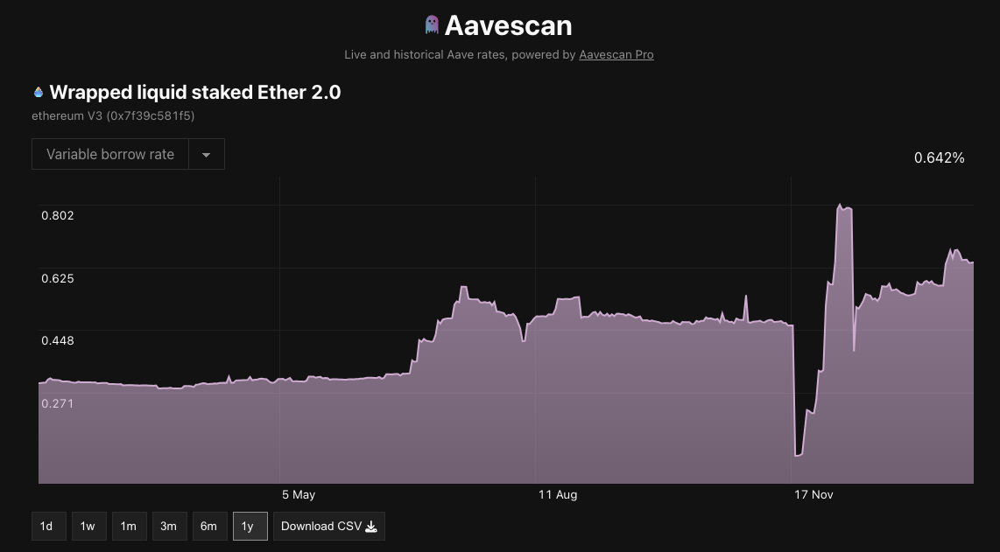
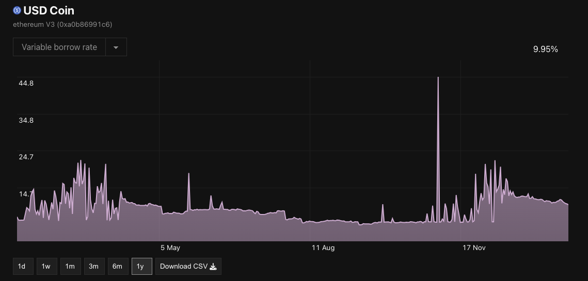
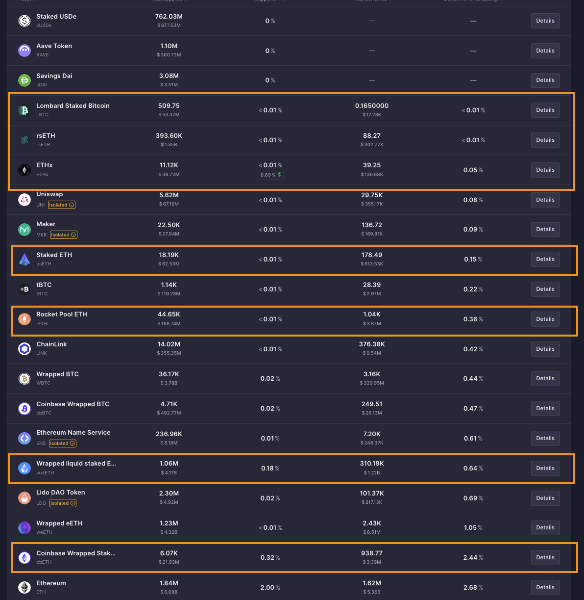

+++
title = "State of restaking: 2025"
date = 2025-01-25T00:00:00Z
authors = ["9oelm"]
sort_by = "date"

[extra]
katex_enable = true
+++

# Review of restaking

# Restaking in hindsight: 2024

## Why do people restake anyways?

### Low utility of LSTs

As we explored before at [Making sense of liquid staking](https://research.lazer1.xyz/blog/making-sense-of-liquid-restaking/), LSTs are tokens that represent the user's staking position, free to be transferred over for any purposes.

Still now in the DeFi landscape, there is not so much utility with LSTs. Historically speaking, the deposit interest rate is surprisingly low compared to other unstaked versions of tokens. Let's take an example of wstETH on Aave over the past 365 days.

The formula of any autonomous yield-bearing system is simple: there needs to be a demand for the token. In the case of wstETH on Aave v3, there need to be people who are willing to borrow wstETH. However, there aren't just enough people who want to do it. Just let that sink that in for a second - why would you ever want to borrow wstETH instead of WETH anyways? Where are you going to use it?

In contrast, take a look at [the historical borrow rate of USDC in the same Aave market](https://aavescan.com/ethereum-v3/0xa0b86991c6218b36c1d19d4a2e9eb0ce3606eb480x2f39d218133afab8f2b819b1066c7e434ad94e9e). We can easily notice that USDC, being a stablecoin, has a lot more utility than wstETH.

This is a general pattern over any other staked asset across the network:

You can see that they are in a very low range of deposit and borrrow interest rates, typically ranging below 1%. This means there's not a big demand for these assets.

In comparison, observe that normally, other mainstream, unstaked assets would give tasty yields:

And yes, you could potentially provide liquidity to Uniswap and earn fees, but that requires holding both tokens that form the pool. In fact, it seems that not a lot of people are interested in providing liquidity to wstETH pools or even swapping wstETH with something else in the first place. As of today, there are only two wstETH pools on Uniswap amongst the top 100 pools by TVL: [wstETH/ETH at 17M TVL and 6.181% APR](https://app.uniswap.org/explore/pools/ethereum/0x109830a1AAaD605BbF02a9dFA7B0B92EC2FB7dAa) and [another wstETH/ETH pool at 2M TVL and 0.867% APR](https://app.uniswap.org/explore/pools/arbitrum/0x35218a1cbaC5Bbc3E57fd9Bd38219D37571b3537).

Balancer has a few wstETH pools too: 
- [wstETH/ETH](https://balancer.fi/pools/ethereum/v2/0x93d199263632a4ef4bb438f1feb99e57b4b5f0bd0000000000000000000005c2): 0.4% base APR from swap fees, at 37M TVL.
- [wstETH/AAVE](https://balancer.fi/pools/ethereum/v2/0x3de27efa2f1aa663ae5d458857e731c129069f29000200000000000000000588): 1.19% base APR from swap fees, at 312M TVL.
- And many other exotic pairs.

But the point is that generating yield from swaps intrinsically exposes you to greater risks, first because you need to hold another token. For example, if you are an liquidity provider for wstETH/ETH, you are essentially exposing yourself to x2 ETH than when you would just hold wstETH. So in case of a price drop, you are losing double more money. This is worse for wstETH with an exotic pair, increasing the likelihood of [impermanent loss](https://support.uniswap.org/hc/en-us/articles/20904453751693-What-is-Impermanent-Loss). Also, there's much less reason to expect high APRs from a pool that swaps wstETH with an exotic pair, because it must not be too popular. This suggests that a rational investor who still wants to hold onto wstETH and create a pool to minimize risks, would most likely create a staking pool (namely, staked asset/unstaked asset, like wstETH/ETH).

Moreover, the TVL of these staking pools across swaps is not big compared to other popular pairs that easily go over 100-200M TVL. This means that generally liquidity providers are less inclined to allocate significant capital to these pools compared to more popular or volatile pairs. Given this TVL, these liquidity providers represent only a very small proportion of the entire group of staked token holders who otherwise are not willing to use LPs to earn yield for their own reasons. If someone with a huge capital were to bring in liquidty into wstETH/ETH pairs, that is going to be another problem as well, because that will significantly drop the APR of the pool. All in all, we've discovered that:

1. People are not really interested in swapping wstETH with something else, compared to other mainstream pools.
2. People are not really interested in providing wstETH to a liquidity pool, to other mainstream pools.

Therefore, while liquidity pools could certainly be used as an option for yield, it does not appear to be a very attractive option for those who hold staked tokens.

### Positive feedback loop in an expectation for rewards and airdrops

Since LSTs won't hardly give satisfactory, risk-safe yields, people ran to EigenLayer and started depositing their idle staked ETH.

## Ethereum

### EigenLayer

Sharing the security of an existing network, namely Ethereum mainnet with no additional cost of having to launch a project token.

### Symbiotic

Multi-token restaking

### Karak

## Solana

### Solayer

### Picasso

### Jito

## Bitcoin

How the blockchain of Bitcoin is not run on PoS, but still can be restaked.

### Babylon

### Pell network

# Current problems

## Revenue model

Revenues come from AVS. But AVS should make enough money and pay it to feed all restakers.

# References

- [[Four Pillars] Restaking Stack: Categorizing the Restaking Ecosystem](https://4pillars.io/en/articles/restaking-stack-restaking-series-1)
- [[Gauntlet] Inside the Restaking Ecosystem: Restaking Protocols](https://www.gauntlet.xyz/resources/inside-the-restaking-ecosystem-restaking-protocols)