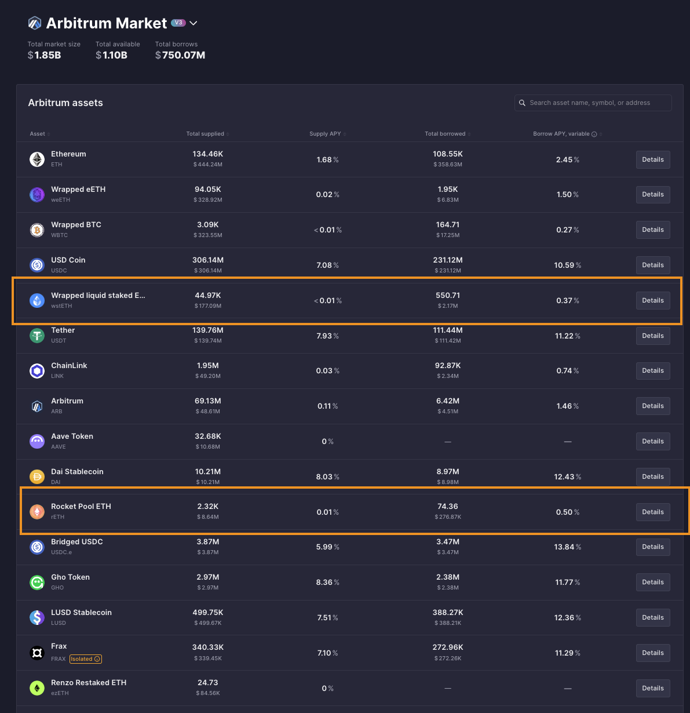
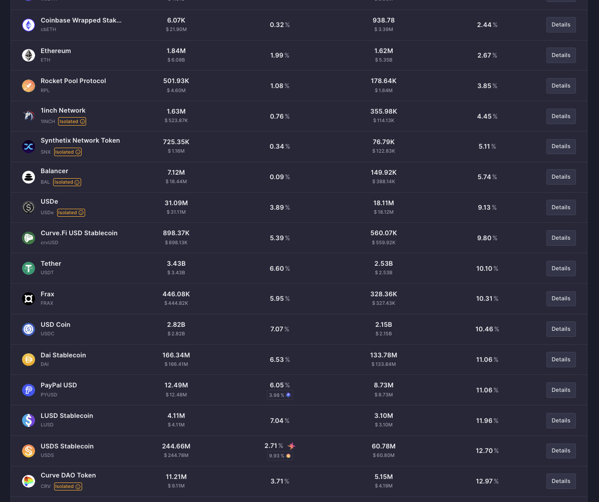
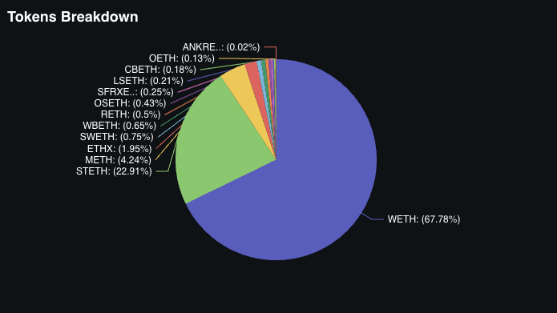

+++
title = "Crash course on the state of restaking: 2025"
date = 2025-01-25T00:00:00Z
authors = ["9oelm"]
sort_by = "date"

[extra]
katex_enable = true
+++

## Why do people restake anyways?

### Low utility of LSTs

As we explored before at [Making sense of liquid staking](https://research.lazer1.xyz/blog/making-sense-of-liquid-restaking/), LSTs are tokens that represent the user's staking position, free to be transferred over for any purposes.

Still now in the DeFi landscape, there is not so much utility with LSTs. Historically speaking, the deposit interest rate is surprisingly low compared to other unstaked versions of tokens. Let's take an [example of wstETH on Aave over the past 365 days](https://aavescan.com/ethereum-v3/0x7f39c581f595b53c5cb19bd0b3f8da6c935e2ca00x2f39d218133afab8f2b819b1066c7e434ad94e9e).

The formula of any autonomous yield-bearing system is simple: there needs to be a demand for the token to generate a yield. In the case of wstETH on Aave v3, there need to be people who are willing to borrow wstETH. However, there aren't just enough people who want to do it. Just let that sink that in for a second - why would you ever want to borrow wstETH instead of WETH anyways? Where are you going to use it?

In contrast, take a look at [the historical borrow rate of USDC in the same Aave market](https://aavescan.com/ethereum-v3/0xa0b86991c6218b36c1d19d4a2e9eb0ce3606eb480x2f39d218133afab8f2b819b1066c7e434ad94e9e). We can easily notice that USDC, being a stablecoin, has a lot more utility than wstETH.

This is a general pattern over any other staked asset across the network:

You can see that they are in a very low range of deposit and borrrow interest rates, typically ranging from 0% to 1%. This means there's not a big demand for these assets.

In comparison, observe that normally, other mainstream, unstaked assets would give tasty yields:

And yes, you could potentially provide liquidity to Uniswap and earn fees, but that requires holding both tokens that form the pool. In fact, it seems that not a lot of people are interested in providing liquidity to wstETH pools or even swapping wstETH with something else in the first place. As of today, there are only two wstETH pools on Uniswap amongst the top 100 pools by TVL: [wstETH/ETH at 17M TVL and 6.181% APR](https://app.uniswap.org/explore/pools/ethereum/0x109830a1AAaD605BbF02a9dFA7B0B92EC2FB7dAa) and [another wstETH/ETH pool at 2M TVL and 0.867% APR](https://app.uniswap.org/explore/pools/arbitrum/0x35218a1cbaC5Bbc3E57fd9Bd38219D37571b3537).

Balancer has a few wstETH pools too: 
- [wstETH/ETH](https://balancer.fi/pools/ethereum/v2/0x93d199263632a4ef4bb438f1feb99e57b4b5f0bd0000000000000000000005c2): 0.4% base APR from swap fees, at 37M TVL.
- [wstETH/AAVE](https://balancer.fi/pools/ethereum/v2/0x3de27efa2f1aa663ae5d458857e731c129069f29000200000000000000000588): 1.19% base APR from swap fees, at 312M TVL.
- And many other exotic pairs.

But the point is that generating yield from swaps intrinsically exposes you to greater risks, first because you need to hold another token. For example, if you are an liquidity provider for wstETH/ETH, you are essentially exposing yourself to x2 ETH than when you would just hold wstETH. So in case of a price drop, you are losing double more money. This is worse for wstETH with an exotic pair, increasing the likelihood of [impermanent loss](https://support.uniswap.org/hc/en-us/articles/20904453751693-What-is-Impermanent-Loss). Also, there's much less reason to expect high APRs from a pool that swaps wstETH with an exotic pair, because it must not be too popular. This suggests that a rational investor who still wants to hold onto wstETH and create a pool to minimize risks, would most likely create a staking pool (namely, staked asset/unstaked asset, like wstETH/ETH).

Moreover, the TVL of these staking pools across swaps is not big compared to other popular pairs that easily go over 100-200M TVL. This means that generally liquidity providers are less inclined to allocate significant capital to these pools compared to more popular or volatile pairs. Given this TVL, these liquidity providers represent only a very small proportion of the entire group of staked token holders who otherwise are not willing to use LPs to earn yield for their own reasons. If someone with a huge capital were to bring in liquidty into wstETH/ETH pairs, that is going to be another problem as well, because that will significantly drop the APR of the pool. All in all, we've discovered that:

1. People are not really interested in swapping wstETH with something else, compared to other mainstream pools.
2. People are not really interested in providing wstETH to a liquidity pool, to other mainstream pools.

Therefore, while liquidity pools could certainly be used as an option for yield, it does not appear to be a very attractive option for those who hold staked tokens.

### Positive feedback loop in an expectation for rewards and airdrops

Since LSTs won't hardly give satisfactory, risk-safe yields, people ran to EigenLayer and started depositing their idle staked ETH.

It only took a year for them to reach 1B in TVL! And now it's sitting at 14.3B. This definitely tells something about the idleness of staked tokens.

[EigenLayer only launched their mainnet on Apr 9, 2024](https://www.blog.eigenlayer.xyz/mainnet-launch-eigenlayer-eigenda/). This is almost a year away from [June 2023 when they first launched their stage 1, where hardly any core features of a restaking protocol were built](https://www.blog.eigenlayer.xyz/eigenlayer-stage-1-mainnet-launch/). It was just a bare-metal deposit and withdrawal system without yields. But still, people ran and deposited, mainly in expectation for airdrop points. Increasing number of depositors led to even higher TVL, which in turn resulted in even higher expectation for project token price, which in turn brought in even more depositors who shared the same expectation.

Other protocols saw a similar trend. To name a few, Symbiotic, Karak, Babylon, Solayer and alike. They all saw a great increase in TVL, which is incomparable to other DeFi protocols, which are usually in the unit of few tens or hundreds of millions only. Today, these are some of the top DeFi protocols by TVL in the world.

# Restaking landscape

In this section, we review how different restaking protocols have been evolving across different chains. The biggest premise of a restaking protocol is that it needs to support a major asset that has a market cap that is large enough to share an economic security. For this reason, the restaking protocols have been mainly developed on Bitcoin, Ethereum, and Solana.

## Ethereum

### EigenLayer

Since its birth in 2023, EigenLayer's goal has been to sharing the security of an existing network, namely Ethereum mainnet. It provides decentralized systems with no additional cost of having to launch a project token. EigenLayer is the first restaking protocol ever to be created. Now in 2025, EigenLayer supports depositing more ERC20 tokens. However, Ethereum remains as the most dominant asset that is deposited:

_Restaked token distribution on Defillama as of Jan 31, 2025_

_Restaked token distribution on EigenLayer App as of Jan 31, 2025_

Approximately, more than 95% of the restaked tokens account for staked ETH variants and $EIGEN token. This is an interesting point, because Eigenlayer clearly supports more ERC20 tokens, like below:

This may suggest that a restaking protocol's positioning strategy is important, as it is a signal that most users still tend to bring in Ethereum instead of other ERC20s.

#### How EigenLayer works

These are the few most important concepts in EigenLayer's architecture, which are also shared by other prominent protocols. Let's go into detail:

**Restakers**. people who stake again their staked token to EigenLayer. This term has been diluted a little bit, as people also 'restake' plain, unstaked ERC20 tokens as well as ETH too. But we will keep calling it restaking and restakers to refer to the activity of delegating tokens of value to provide security for decentralized services.

**Actively Validated Services (AVSs henceforth)**. decentralized service that has unique off-chain logics that are validated by on-chain contracts. The categories of AVS are seen below:

A practical example of an AVS is [EigenDA](https://docs.eigenda.xyz/). It is an AVS developed by EigenLayer, which specifically takes care of data availability problems for modern rollups on Ethereum. Another example is [Hyperlane](https://app.eigenlayer.xyz/avs/0xe8e59c6c8b56f2c178f63bcfc4ce5e5e2359c8fc), which is an interoperability protocol.

Every AVS is an on-chain contract for validation and an off-chain network of operators. 

**Slashing**. Before EigenLayer, it used to mean penalizing dishonest or dysfunctional validators in a PoS network like Ethereum. Now, in EigenLayer, slashing refers to penalizing operators who secured an AVS that could not complete a task correctly by burning the restaked tokens.

**Operators**. They run AVS and send the evidence of the execution on-chain to confirm the work. Restakers choose to delegate their tokens to specific operators. There are many operators on EigenLayer today. The primary reason for being an operator is an economic incentives in expectation for rewards for their operating jobs. By default, Operators will earn a flat 10% split on rewards. The rest of the reward is claimable by the operator's delegated stakers.

It's worth noting that the operators cannot directly transfer the delegated tokens, but they relate them to AVSs for slashing, so that when real slashing happens, the delegated tokens will be burnt. [TODO]

_Restakers choose to delegate their tokens to specific operators._

_A list of operators on EigenLayer._

**Free-market governance**. As we will cover more later on, different operators will servce different risk appetites. In a sense, operators act like different vaults that are exposed to different levels of risks. For example, Operator A may serve AVSs that are prone to more slashing, resulting in higher rewards APR but higher chance of slashing (loss). In contrast, Operator B may serve AVSs that are more stable and less risky. These AVSs will tend to be less sophisticated and to run simpler tasks, resulting in smaller rewards APR and lower chance of slashing. 

Practically speaking, let's say Operator A delegates its restaked tokens to a bridge. Operator B delegates its restaked tokens to a decentralized system that calculates the sum of a two different numbers. It becomes pretty obvious that the chances of slashing is higher on the former case, and lower on the latter. The same goes for the rewards; Operator A would yield more rewards for its restakers, and B much less for its restakers.

For this reason, there remains a problem of finding an appropriate level of risk exposure to different AVS categories, because there are many operators, and EigenLayer does not offer a specific interface for comparing risks across different operators and AVSs. If you are interested in this problem, you might want to look into what [YieldNest](https://docs.yieldnest.finance/introduction/why-yieldnest) is doing: optimizing yield for the users by providing offers users controlled, liquid, and risk-adjusted exposure to curated AVS categories.

#### No native fungible token on EigenLayer

Additionally, EigenLayer does not mint a token representing the restaking position upon restaking (e.g., rstETH). This should be pretty clear if you have been following. The reason is that the risk exposure across different operators is different, so there can never be the 'same' restaked ETH.

However, it is possible to get a liquid restaking token on other liquid staking platforms like Ether.fi, where Ether.fi itself will be an operator on EigenLayer, managing a set of AVSs. On [Ether.fi, the restaking position delegated to its operator is represented as eETH](https://etherfi.gitbook.io/etherfi/getting-started/faq). This is possible because there is only one type of risk exposure based on what AVSs Ether.fi operates. Holding this token will earn you staking AND restaking APR, as well as points across different DApps like EigenLayer.

#### Eigen token

### Symbiotic

Multi-token restaking

### Karak

## Solana

### Solayer

### Picasso

### Jito

## Bitcoin

How the blockchain of Bitcoin is not run on PoS, but still can be restaked.

### Babylon

### Pell network

# Current problems

## Revenue model

Revenues come from AVS. But AVS should make enough money and pay it to feed all restakers.

# References

- [[Four Pillars] Restaking Stack: Categorizing the Restaking Ecosystem](https://4pillars.io/en/articles/restaking-stack-restaking-series-1)
- [[Gauntlet] Inside the Restaking Ecosystem: Restaking Protocols](https://www.gauntlet.xyz/resources/inside-the-restaking-ecosystem-restaking-protocols)
- [[EigenLayer] Overview](https://docs.eigenlayer.xyz/eigenlayer/overview)
- [[EigenLayer] Whitepaper](https://docs.eigenlayer.xyz/assets/files/EigenLayer_WhitePaper-88c47923ca0319870c611decd6e562ad.pdf)
- [[EigenLayer] Eigen token Whitepaper](https://docs.eigenlayer.xyz/assets/files/EIGEN_Token_Whitepaper-0df8e17b7efa052fd2a22e1ade9c6f69.pdf)